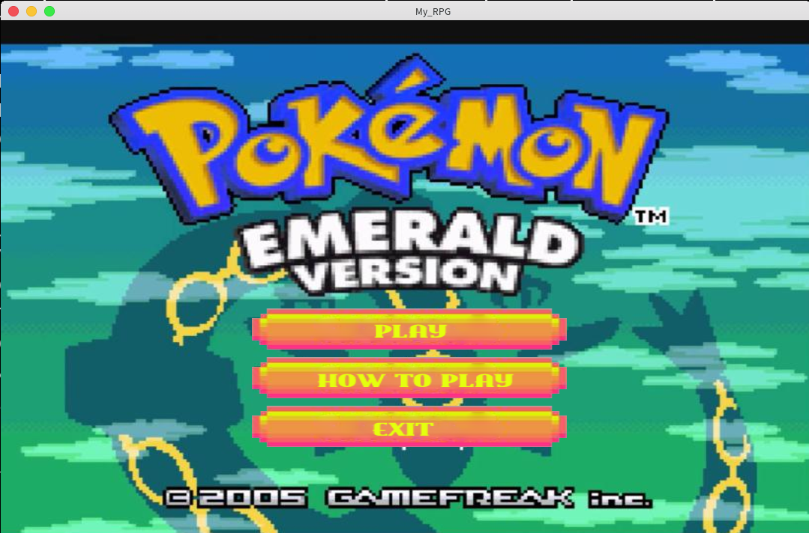

# My_rpg

## A Role Play game coded in C with the CSML library



## Usage

``` zsh
make
./my_rpg
```
With this project I learned graphical programming, and how to use CFSML and collaborating with 3 teammates:
- [Mathis Lesur](https://github.com/tistech0 "tistech0"),
- [Louis Maestre](https://github.com/Louismaestre "Louismaestre"),
- [Victor Harri-Chal](https://github.com/VictorHarri-Chal "VictorHarri-Chal").

## Features

- Dialogues
- Fights
- A final boss
___
Check my [portfolio](http://simonlefourn.com) for more informations on this project.

